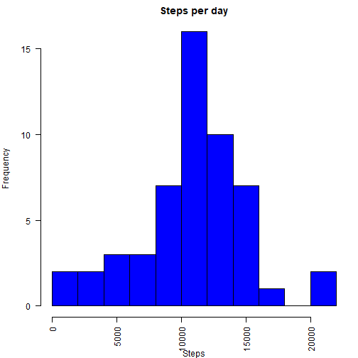
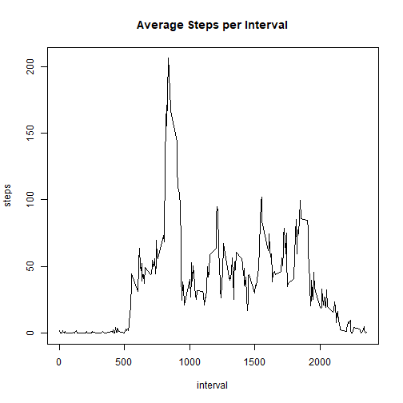
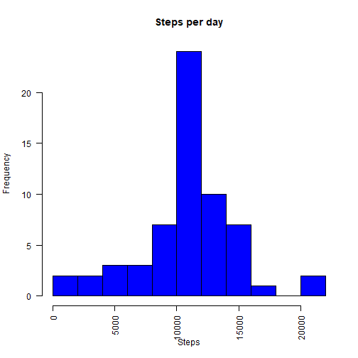
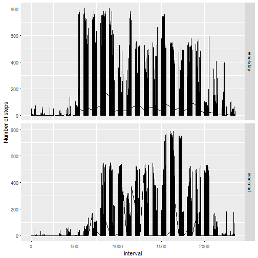

Reproducible Research: Peer Assessment 1
========================================

## Loading and preprocessing the data

```r
library(plyr)
library(reshape2)
library(dplyr)
library(ggplot2)
setwd("C:\\Users\\Ult\\Documents\\R\\course5progrAssignment1\\RepData_PeerAssessment1")
source <- read.csv( unz("activity.zip", "activity.csv") )
```


## What is mean total number of steps taken per day?
### Histogram of the total number of steps taken each day

```r
df_melt <- melt(source, id = c("date"))
perday <- dcast(df_melt, date ~ variable, sum)
par(mfrow=c(1,1), mar = c(4,4,2,1))
hist(perday$steps, col = "blue", xlab = "Steps", main = "Steps per day", las=2, breaks = 10)
```



### Mean number of steps taken each day

```r
mean(perday$steps, na.rm = TRUE)
```

```
## [1] 10766.19
```
### Median number of steps taken each day

```r
median(perday$steps, na.rm = TRUE)
```

```
## [1] 10765
```


## What is the average daily activity pattern?
### Time series plot of the average number of steps taken

```r
df_melt <- melt(source[-c(2)], id = c("interval"))
perinterval <- dcast(df_melt, interval ~ variable, mean, na.rm = TRUE)
plot(perinterval,type = "l", pch=27, ylab = "steps",xlab = "interval", main = "Average Steps per Interval")
```



### The 5-minute interval that, on average, contains the maximum number of steps

```r
perinterval$interval[which.max(perinterval$steps)]
```

```
## [1] 835
```


## Imputing missing values
### Code to describe and show a strategy for imputing missing data
Lets put interval mean value where steps value is NA

```r
naCount <- sum(rowSums(is.na(source)))
names(perinterval)[names(perinterval)=="steps"] <- "meanSteps"
dfList = list(source, perinterval)
source2 <- suppressMessages(join_all(dfList))
source2$steps <- ifelse(is.na(source2$steps), source2$meanSteps, source2$steps)
source2 <- source2[-c(4)]
```

### Histogram of the total number of steps taken each day after missing values are imputed

```r
df_melt <- melt(source2, id = c("date"))
perday <- dcast(df_melt, date ~ variable, sum)
meanPerDayImputed <- mean(perday$steps, na.rm = TRUE)
medianPerDayImputed <- median(perday$steps, na.rm = TRUE)
hist(perday$steps, col = "blue", xlab = "Steps", main = "Steps per day", las=2, breaks = 10)
```



## Are there differences in activity patterns between weekdays and weekends?
### Panel plot comparing the average number of steps taken per 5-minute interval across weekdays and weekends

```r
source2$wkd <- ifelse((weekdays(as.Date(source2$date))=="суббота")|(weekdays(as.Date(source2$date))=="воскресенье"), "weekend", "weekday")
qplot(interval, steps, data=source2, geom= c("line"), facets = wkd ~ . ,xlab="Interval", ylab="Number of steps")
```



